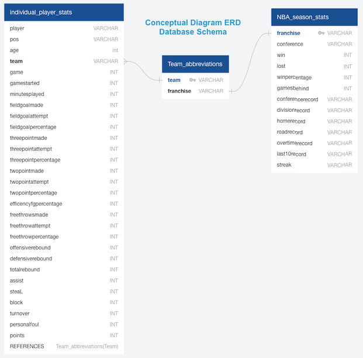
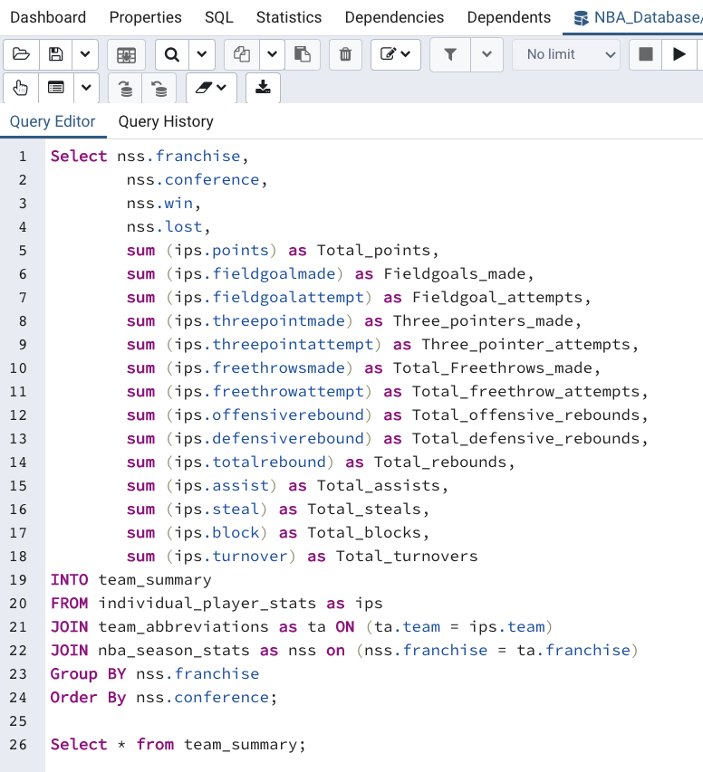
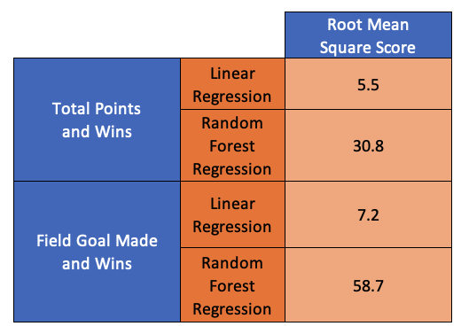
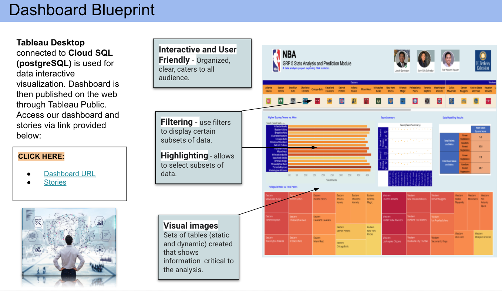

## Overview of the Analysis
Through our common interest in basketball we wanted to dig deeper into NBA team statistics. Our plan is to use NBA stats to predict the winner of the current NBA season. 

## Team Members

## Questions we want to answer
* Is there a correlation between higher scoring teams and wins?
* Does defense statistics correlate with team wins?
* How accurate is our model?

**Dataset sources:**

* [Link to NBA individual player statistics](https://www.basketball-reference.com/leagues/NBA_2021_per_game.html) Our data was pulled on 2/18/2021

* [Link to NBA team franchise names and abbreviations](https://en.wikipedia.org/wiki/Wikipedia:WikiProject_National_Basketball_Association/National_Basketball_Association_team_abbreviations)

* [Link to NBA team standings](https://www.nba.com/standings) Our data was pulled on 2/18/2021

**Fields of importance Examples:**

* Points
* Wins
* Field Goal Made
* Defensive Rebounds
* Blocks
* Steals

## Technologies and Process Flow

**Google Cloud SQL** - *a fully-managed database service that helps set up, maintain, manage, and administer relational databases on Google Cloud Platform.*

**PostgreSQL** - *a highly stable database management system used as the primary data store or data warehouse for analytics applications.*

**Jupyter Notebook** - *an open-source web application that allows creation and sharing of documents that contain live code, equations, visualizations and explanatory text. Use for data cleaning and transformation, numerical simulation, statistical modeling, machine learning.*

**Tableau Desktop / Public** - *a business intelligence and data visualization tool. It specializes in transforming tabulated data into interactive graphs and representations.*

## Database Setup and Exploratory Data

* Our database contains three tables. More information on the database setup can be found here:

[Link to the Database Information README](https://github.com/JmSambajon/group5-project/blob/johns_data_analytics/DatabaseInfo.md)

* Here is an ERD of our database:

* Tables were joined to generate new tables for data processing in postgreSQL:

## Data Analysis and Machine Learning

We plan to use a linear regression model. More information on the model can be found here:

[Link to the Model Information README](https://github.com/JmSambajon/group5-project/blob/main/MachineLearningMDW3.md)

[Link to the final notebook for modelling](https://github.com/JmSambajon/group5-project/blob/main/Refining%20for%20Segment%203.ipynb)

**Explored the following analytics:**

- Logistic Regression

- Linear Regression

- Pearson Correlation Coefficient

- Mean Square Regression

- Random Forest Regression Model

**Modelling results:**

## Data Visualization and Dashboard:

The dashboard was created using Tableau Desktop and Public. More information on the dashboard creation can be found in the links provided below:

[Link to the Data Visualization and Dashboard README](https://github.com/JmSambajon/group5-project/blob/main/Circle_Segment2.md)

**Dashboard Blueprint:**

**Interactive Dashboard and Stories:**

[Link to Tableau Dashboard Website](https://public.tableau.com/profile/john.s.2695#!/vizhome/Dashboard1_16143159757440/Dashboard2?publish=yes)

[Link to Tableau Story Website](https://public.tableau.com/profile/john.s.2695#!/vizhome/Dashboard1_16143159757440/Dashboard2?publish=yes)

## Presentation Slides

[Link to the Google Presentation](https://docs.google.com/presentation/d/15FJdZAEZWmijdhovykL48H5_bhHrKH4fqiXHvQegeHI/edit?usp=sharing)

## Lesson Learned, Conclusion, and Next Steps

**Lesson Learned and Analysis:**

- Recognized that accuracy calculation is meaningless and should not be used for Logistic Regression modelling.

- Total points and wins and it is not a good indicator based on Linear Regression and Random Forest modelling. 

- Comparing the Pearson Correlation Coefficient with Wins and it has no correlation with any of the NBA individual statistics. This includes defensive statistics.

- With high Pearson Correlation coefficient and strong linear regression, there is a correlation between field goal and total points. When a team makes a lot of field goal, they will score a lot of points

**Conclusion:**

1. Is there a correlation between higher scoring teams and wins?

- *There is no correlation between the higher scoring teams and wins.*

2. Does defense statistics correlate with team wins?

- *None of the defensive statistics correlated to winning the championship. In general, none of the NBA statistics correlated with winning games.*

3. How accurate are our models?

- *Our models are not accurate at predicting the winner of the NBA championships.*

**Next Steps:**

Future Recommended analysis:

- *Refine data source by performing data cleaning to remove nuances that could affect the modeling result.*

**Update:** *Performed data cleaning as recommended by our Teaching Assistant (TA). Removed the "Team" column and performed binary encoding on the "Conference" column. Repeated the modelling analysis and obtained the same results.*

[Link to the notebook for data cleaning and reanalysis](https://github.com/JmSambajon/group5-project/blob/main/Modelling%20for%20Segment%204.ipynb)

- *Explore Field Goal Attempt instead of Field Goal Made.*

- *Perform multiple predictors.*

- *Limited to only 5 seasons of data. With more funding, more season data can be obtained from NBA API.*

## Resources

[Link to Multiple Linear Regression notebook](https://github.com/JmSambajon/group5-project/blob/main/Refined%20Model%20for%20Segment%202.ipynb)

[Link to Joined data sql schema](https://github.com/JmSambajon/group5-project/blob/main/Joined_data_schema.sql)

[Link to notebook for uploading datafiles in postgreSQL](https://github.com/JmSambajon/group5-project/blob/main/NBA%20Database.ipynb)

[Link to gitignore](https://github.com/JmSambajon/group5-project/blob/main/.gitignore)

[Link to requirements.txt](https://github.com/JmSambajon/group5-project/blob/main/requirements.txt)

